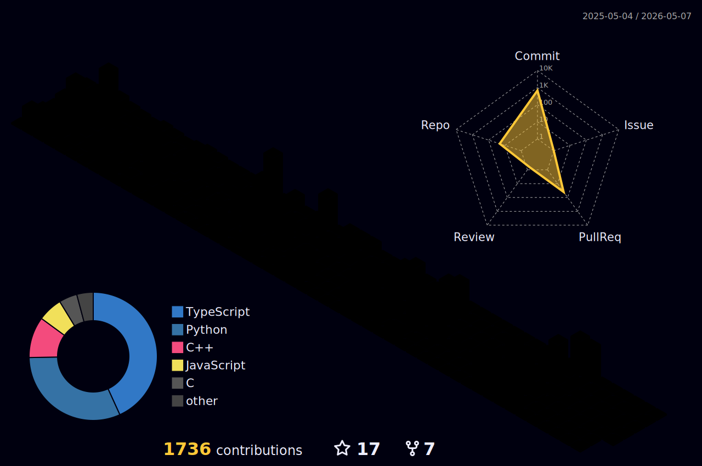

<div align="center">


</div>

<br/>

<div align="center">

</div>

<br/>

<div align="center">
  
  &nbsp;&nbsp;
  
  &nbsp;&nbsp;
  
  &nbsp;&nbsp;
  
</div>

<br/>

<!-- ─────────────────────────────────────────── -->


<br/>

```python
class AllenBobby:

    name     = "Allen Bobby"
    title    = "AI Engineer & Agent Architect"
    location = "India"
    contact  = "allenbobby2003@gmail.com"

    building = [
        "AI agents that run inside real systems",
        "Agentic workflows — LangGraph / ReAct",
        "RAG pipelines with memory & tool-use",
        "Internal automation replacing job functions",
        "Local LLM deployments that ship to prod",
    ]

    belief = """
        Give software tools → it becomes useful.
        Give AI tools       → it becomes a coworker.
    """
```

<br/>

<!-- ─────────────────────────────────────────── -->


<br/>

<table align="center">
<tr>
<td align="center" width="25%">
<br/>
<b>Agentic Workflows</b><br/>
<sub>ReAct · LangGraph · Tool-use</sub>
</td>
<td align="center" width="25%">
<br/>
<b>RAG Pipelines</b><br/>
<sub>ChromaDB · Embeddings · Search</sub>
</td>
<td align="center" width="25%">
<br/>
<b>Local AI</b><br/>
<sub>Ollama · GGUF · On-premise</sub>
</td>
<td align="center" width="25%">
<br/>
<b>Automation</b><br/>
<sub>FastAPI · Webhooks · Ops</sub>
</td>
</tr>
</table>

<br/>

<!-- ─────────────────────────────────────────── -->


<br/>

<div align="center">


<br/><br/>


</div>

<br/>

<!-- ─────────────────────────────────────────── -->


<br/>

<div align="center">

&nbsp;

</div>

<br/>

<div align="center">
  
</div>

<br/>

<!-- ─────────────────────────────────────────── -->


<br/>

<div align="center">
  <picture>
    <source media="(prefers-color-scheme: dark)" srcset="https://raw.githubusercontent.com/melo-maniac-29/melo-maniac-29/output/github-snake-dark.svg" />
    <source media="(prefers-color-scheme: light)" srcset="https://raw.githubusercontent.com/melo-maniac-29/melo-maniac-29/output/github-snake.svg" />
    
  </picture>
</div>

<br/>

<!-- ─────────────────────────────────────────── -->


<br/>

<div align="center">
  
</div>

<br/>

<!-- ─────────────────────────────────────────── -->


<br/>

<div align="center">

<a href="https://linkedin.com/in/allenbobby">
  
</a>
&nbsp;
<a href="mailto:allenbobby2003@gmail.com">
  
</a>
&nbsp;
<a href="https://github.com/melo-maniac-29">
  
</a>

</div>

<br/>

<div align="center">
  
</div>

<br/>

<div align="center">
  <sub><i>I don't build chatbots. I build coworkers.</i></sub>
</div>

<br/>


